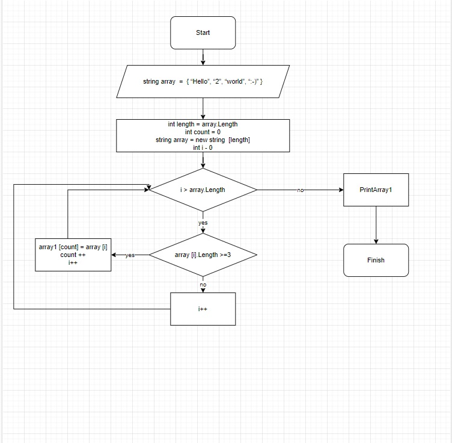

## ***1. Создание массива*** 

Создаем строкового массива **"array1"** на старте выполнения алгоритма.

## ***2. Метод печати массива*** 

Создаем метода **"PrintArray"** вывода(печати) массива в терминал для массива **"array1"** .

## ***3. Создание метода __"NewArray"__.***  

Создаем метод, из массива которого **"array1" **
те строки из массива "массив1", которые охватывают строки не более трех символов.

Набор, который в новом массиве количества строк может быть меньше, чем в обычном методе **"Array.Resize"** , который принимает на вход
представляет массив **"array1"** и **"count"** - количество элементов в новом массиве, а затем обрезает пустые строки в новом массиве.

## ***4. Метод печати массива "NewArray".*** 

Создаем метод **"PrintArray1"** для вывода в терминал нового массива.

## ***5. Вызов методов.*** 

1. Выводим массив **"array1"** с помощью метода **"PrintArray"** .
2. Создаем новый массив **"arraynew"** с помощью метода **"NewArray"** .
3. Выводи массив **"arraynew"** с помощью метода **"PrintArray1"** .

